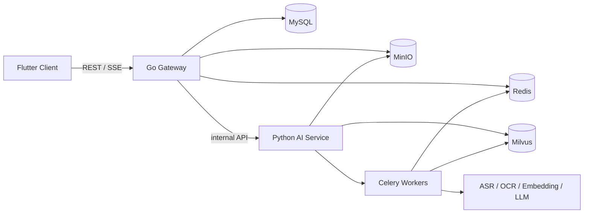

# MKC - Multimedia AI Knowledge Companion

[](https://github.com/coderZsq/MKC/actions/workflows/ci-gateway.yml)
[](https://github.com/coderZsq/MKC/actions/workflows/ci-ai-service.yml)
[](https://github.com/coderZsq/MKC/actions/workflows/ci-client.yml)

MKC 是一个多媒体 AI 知识库助手：用户上传音频或 PDF 后，系统完成转写、解析、清洗、向量化、检索增强生成，并在 Flutter 客户端中提供资源管理、任务进度、摘要、标签、引用跳转和 SSE 流式问答。



## Core Features

- Upload MP3 and PDF resources with authenticated task tracking.
- Convert audio into SRT and cleaned text.
- Extract searchable text from PDFs, including OCR fallback.
- Generate summaries, tags, entities, and resource cards.
- Build a vector index and answer questions through RAG.
- Stream multi-turn chat over SSE with citation metadata.
- Trace requests, expose Prometheus metrics, and provide fallback errors.
- Run local evaluation datasets and LLM-as-judge reports.

## Tech Stack

| Layer | Main Tools |
|---|---|
| Client | Flutter, Riverpod, go_router, Dio |
| Gateway | Go, Gin, GORM, MySQL, Redis, MinIO |
| AI Service | Python, Flask, Celery, LangGraph, LlamaIndex |
| Retrieval | Milvus, hybrid retrieval, rerank hooks |
| Observability | OpenTelemetry, Prometheus, Grafana, Jaeger, Langfuse/LangSmith hooks |
| Infra | Docker, Docker Desktop Kubernetes, nginx-ingress, Kubernetes manifests |

## Repository Map

```text
.
├── client/       # Flutter Web/Desktop client
├── gateway/      # Go API gateway and persistence boundary
├── ai-service/   # Flask API, Celery tasks, AI pipelines, eval tools
├── infra/        # Local Kubernetes, observability, and helper scripts
├── docs/         # Product, architecture, API, runbooks, and test cases
└── scripts/      # Local multi-process startup helpers
```

## Quick Start

### 1. Prepare Tools

- Docker Desktop with Kubernetes enabled.
- `kubectl`, `curl`, `nc`, `lsof`, and `envsubst`.
- Go 1.22 or newer.
- Python 3.11 or newer.
- Flutter SDK 3.22 or newer with Chrome support.
- Optional: Ollama with `bge-m3` and `deepseek-r1:8b`.

On macOS, `envsubst` is available through gettext:

```bash
brew install gettext
```

### 2. Start Local Infrastructure

```bash
export MYSQL_ROOT_PASSWORD=dev-root
export MYSQL_PASSWORD=dev-mkc
export REDIS_PASSWORD=dev-redis
export MINIO_ROOT_PASSWORD=dev-minio

./infra/scripts/local-up.sh
```

Keep a second terminal open for port forwarding:

```bash
./infra/scripts/port-forward.sh
```

Default forwarded services:

| Service | Local Address |
|---|---|
| MySQL | `localhost:3306` |
| Redis | `localhost:6379` |
| MinIO S3 | `localhost:9000` |
| MinIO Console | `localhost:9001` |
| Jaeger UI | `localhost:16686` |
| Milvus | `localhost:19530` |

### 3. Install AI Service Dependencies

```bash
cd ai-service
python -m venv .venv
source .venv/bin/activate
make install
cp config/.env.example .env
cd ..
```

For the default local mock mode, no external model key is required. For local Ollama embedding, pull the embedding model first:

```bash
ollama pull bge-m3
```

### 4. Start the App

```bash
./scripts/local-dev-up.sh
```

The script starts AI Service, Celery worker, Gateway, and Flutter. Logs and PID files are stored in `.mkc-dev/`.

Useful local endpoints:

| Service | URL |
|---|---|
| Gateway health | `http://localhost:8080/health` |
| Gateway API health | `http://localhost:8080/api/v1/health` |
| AI Service health | `http://localhost:5001/api/v1/health` |
| Gateway metrics | `http://localhost:8080/metrics` |
| AI Service metrics | `http://localhost:5001/metrics` |

Demo entry points after the Flutter process starts:

- Flutter Web: check the `client.log` output for the Chrome URL printed by `flutter run -d chrome`.
- MinIO Console: `http://localhost:9001`
- Jaeger UI: `http://localhost:16686`
- Swagger/OpenAPI contract: [docs/api/openapi.yaml](docs/api/openapi.yaml)

Stop app processes:

```bash
./scripts/local-dev-down.sh
```

Stop local Kubernetes dependencies:

```bash
./infra/scripts/local-down.sh
```

## Manual Development Commands

Gateway:

```bash
cd gateway
cp config/config.example.yaml config/config.yaml
APP_MYSQL_PASSWORD=dev-mkc \
APP_REDIS_PASSWORD=dev-redis \
APP_JWT_SECRET=dev-jwt-secret \
APP_AI_SERVICE_BASE_URL=http://localhost:5001 \
APP_AI_SERVICE_INTERNAL_KEY=dev-internal-key \
APP_MINIO_ACCESS_KEY=mkc \
APP_MINIO_SECRET_KEY=dev-minio \
go run ./cmd/server
```

AI Service:

```bash
cd ai-service
source .venv/bin/activate
set -a
source .env
DEBUG=false
PORT=5001
set +a
python -m flask --app app.main:create_app run --host=0.0.0.0 --port=5001 --no-debugger --no-reload
```

Celery worker:

```bash
cd ai-service
source .venv/bin/activate
set -a
source .env
set +a
make worker
```

Flutter Web:

```bash
cd client
flutter pub get
flutter run -d chrome \
  --dart-define=BASE_URL=http://localhost:8080/api/v1 \
  --dart-define=STORAGE_HOST=localhost
```

Flutter Web uses the same REST and SSE APIs as desktop. Browser uploads are constrained by browser memory and file picker behavior; large files should stay within the Gateway upload limit and can take longer to hash, preview, or stream from object storage.

## Testing

Gateway:

```bash
cd gateway
go test ./...
go vet ./...
go build ./cmd/server
```

AI Service:

```bash
cd ai-service
DEBUG=true .venv/bin/python -m ruff check .
DEBUG=true .venv/bin/python -m black --check .
DEBUG=true .venv/bin/python -m mypy app
INTERNAL_API_KEY=test-internal-key LLM_PROVIDER=mock LLM_MODEL=glm-4-flash LLM_API_KEY= KIMI_API_KEY=test-key DEBUG=true .venv/bin/python -m pytest -q
```

Client:

```bash
cd client
flutter analyze
flutter test
```

Docs:

```bash
npx --yes markdownlint-cli README.md 'docs/**/*.md'
npx --yes markdown-link-check README.md --config .markdown-link-check.json
find docs -name '*.md' -print0 | xargs -0 -n1 npx --yes markdown-link-check --config .markdown-link-check.json
```

## Deployment

Local development runs dependencies in Kubernetes and application services on the host. Production deployment should build Gateway, AI Service, and Client images, inject secrets through Kubernetes Secret or the cloud secret manager, expose only Gateway and Client publicly, and keep AI Service, Redis, MySQL, MinIO, Milvus, metrics, and tracing endpoints private.

See [Deployment](docs/DEPLOYMENT.md) and [Infrastructure](infra/README.md) for the current manifest layout and known gaps.

## Documentation

| Topic | Link |
|---|---|
| Architecture | [docs/ARCHITECTURE.md](docs/ARCHITECTURE.md) |
| Development | [docs/DEVELOPMENT.md](docs/DEVELOPMENT.md) |
| Deployment | [docs/DEPLOYMENT.md](docs/DEPLOYMENT.md) |
| Troubleshooting | [docs/TROUBLESHOOTING.md](docs/TROUBLESHOOTING.md) |
| API design | [docs/api/api-design.md](docs/api/api-design.md) |
| OpenAPI | [docs/api/openapi.yaml](docs/api/openapi.yaml) |
| Product PRD | [docs/prd/PRD_multimedia_knowledge_assistant.md](docs/prd/PRD_multimedia_knowledge_assistant.md) |
| Tech stack | [docs/tech/TECH_STACK.md](docs/tech/TECH_STACK.md) |
| Agile plan | [docs/AGILE_plan_multimedia_knowledge_assistant.md](docs/AGILE_plan_multimedia_knowledge_assistant.md) |
| Evaluation dataset | [docs/runbooks/evaluation_dataset.md](docs/runbooks/evaluation_dataset.md) |
| LLM-as-judge report pipeline | [docs/runbooks/llm_as_judge_eval_pipeline.md](docs/runbooks/llm_as_judge_eval_pipeline.md) |
| Monitoring runbook | [docs/runbooks/monitoring.md](docs/runbooks/monitoring.md) |
| Error handling runbook | [docs/runbooks/error_handling.md](docs/runbooks/error_handling.md) |

## Security Notes

- Do not commit `.env`, generated Kubernetes Secret files, local databases, logs, model weights, or `.mkc-dev/`.
- Keep `INTERNAL_API_KEY`, JWT secrets, provider keys, database passwords, and MinIO credentials in environment variables or a secret manager.
- The examples in this repository use development placeholders only. Rotate all secrets before deploying outside a local machine.

## License

MIT
