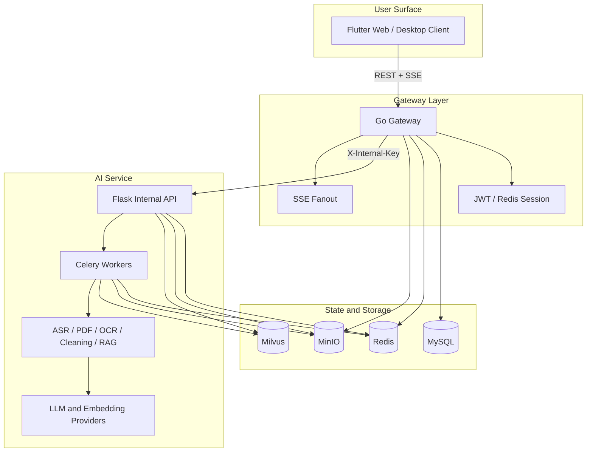
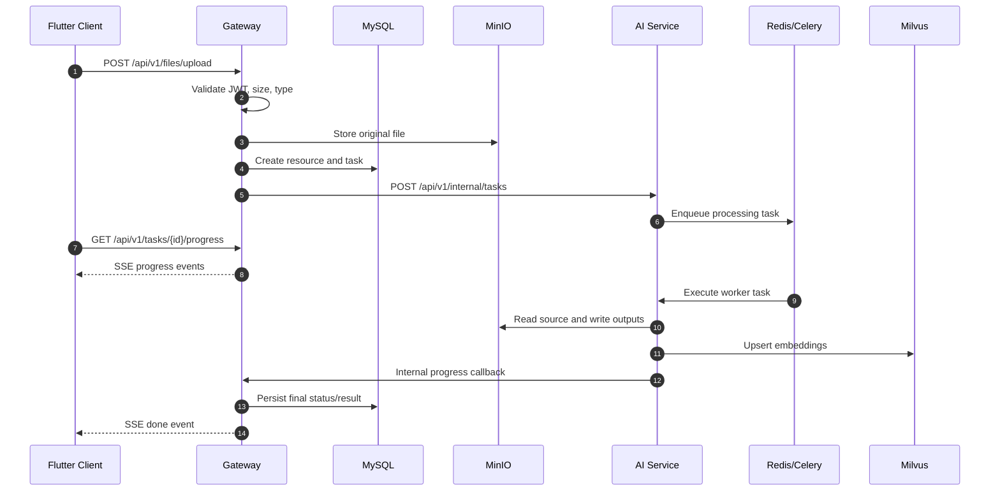
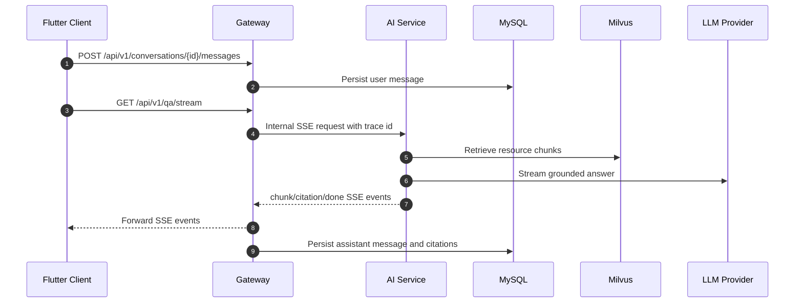

# MKC Architecture

MKC uses a three-service application architecture around a retrieval-augmented generation pipeline. The Gateway owns public HTTP contracts and persistence. The AI Service owns document processing, embedding, retrieval, and model orchestration. The Flutter Client owns user interaction and streams task or chat progress from the Gateway.

## Component Overview

## Responsibilities

| Component | Responsibility | Owns |
|---|---|---|
| Flutter Client | Authentication UI, upload flow, task center, resource views, chat, citation navigation | Presentation state, API adapters, local token storage |
| Go Gateway | Public API, auth, upload validation, task persistence, SSE proxying, object storage URLs | MySQL models, Redis session/task state, MinIO object keys, API envelope |
| Python AI Service | Internal AI APIs, async processing, retrieval, generation, evaluation tools | Flask routes, Celery task execution, model/provider adapters |
| MySQL | Durable business state | Users, resources, tasks, conversations, messages, summaries |
| Redis | Fast coordination | Refresh sessions, task status cache, Celery broker/result backend, SSE coordination |
| MinIO | Binary and generated artifacts | Uploaded files, parsed text, SRT, extracted outputs |
| Milvus | Vector retrieval index | Resource chunks and embeddings |
| Celery | Asynchronous AI work | Transcription, PDF parsing, embedding, RAG-side processing |

## Request Flow

## Chat and RAG Flow

If retrieval succeeds but LLM streaming fails, the AI Service can return a degraded answer from retrieved snippets and mark the final SSE event with `degraded: true`. If retrieval is unavailable, the stream emits a standardized error payload. Details are documented in [Error Handling Runbook](runbooks/error_handling.md).

## Data Model Boundaries

- Gateway database models are the source of truth for users, tasks, resources, conversations, messages, summaries, and extraction metadata.
- MinIO stores large binaries and generated files. Database rows store object keys and metadata, not raw file bodies.
- Milvus stores chunk embeddings keyed by resource and chunk identifiers. It is rebuildable from parsed artifacts and metadata.
- Redis data is disposable coordination state except refresh sessions, which still have bounded TTL and can be invalidated.

## Observability

Every public request should carry or receive a trace id. Gateway propagates trace context to AI Service internal calls; logs and errors include stable identifiers such as `trace_id`, task id, resource id, and conversation id. Prometheus metrics are exposed by Gateway and AI Service, while Jaeger provides local tracing. See [Monitoring Runbook](runbooks/monitoring.md) and [LLM Observability Runbook](runbooks/llm_observability.md).

## Security Model

- Only Gateway is a public API boundary.
- AI Service internal endpoints require `X-Internal-Key`.
- Client stores access credentials through platform secure storage.
- Object storage URLs are presigned and time-limited.
- Error responses are sanitized and do not expose SQL, stack traces, prompts, local paths, or credentials.
- Secrets belong in `.env`, environment variables, Kubernetes Secret, or an external secret manager.

## Deployment Topology

Local development uses Kubernetes for dependencies and host processes for app services. Production should run Gateway, AI Service, Celery workers, databases, storage, ingress, and observability inside managed infrastructure or a hardened Kubernetes cluster. See [Deployment](DEPLOYMENT.md).
