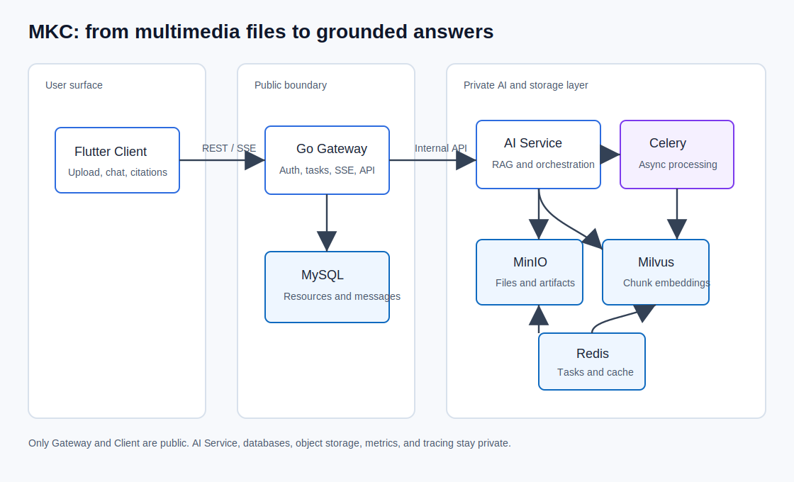
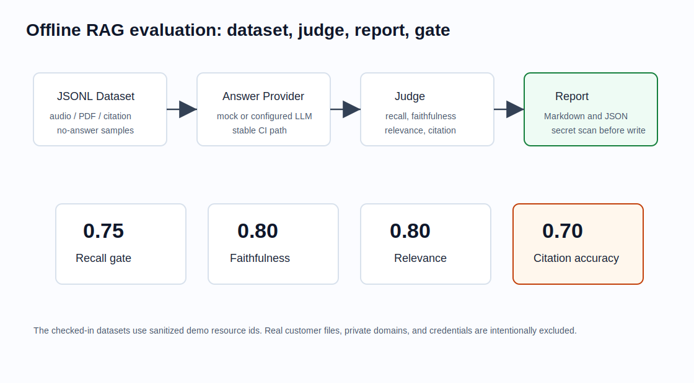
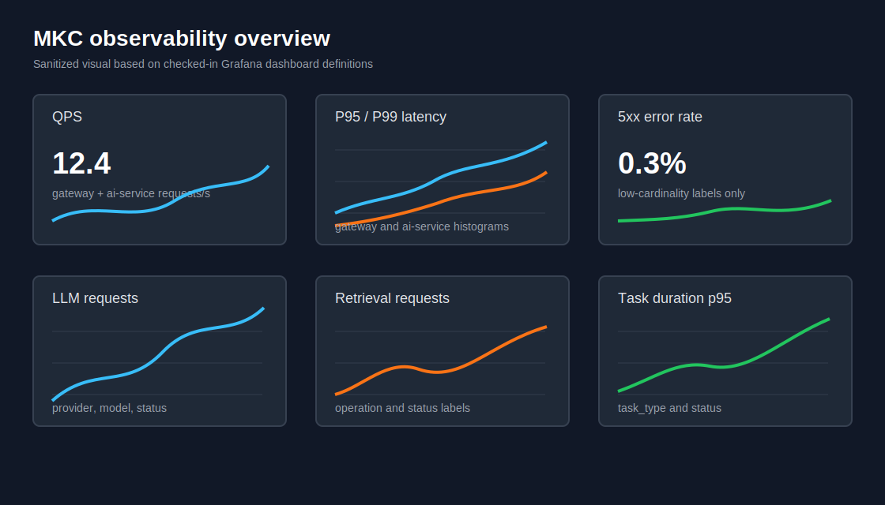

# 从 0 到上线：我如何做一个多媒体 AI 知识库助手 MKC

做一个 RAG Demo 不难。难的是让它像一个真实工程：能上传文件，能异步处理，能追踪状态，能给出引用，能评估效果，出了问题还能定位，最后还能被部署到 Kubernetes。

MKC（Multimedia AI Knowledge Companion）就是围绕这个目标做的一次工程练习。它不是一个“套壳聊天机器人”，而是一个多媒体知识库助手：用户上传音频或 PDF 后，系统完成转写、解析、清洗、向量化、检索增强生成，并在 Flutter 客户端里提供资源管理、任务进度、摘要、标签、引用跳转和 SSE 流式问答。

这篇文章复盘 MKC 从需求、架构、RAG、Agent、可观测性到部署上线的实现过程。所有描述都基于仓库里的真实模块和文档，不把模板能力包装成已经稳定运营的生产系统。



## 项目背景：我想验证的不只是“能问答”

最开始的目标很朴素：把音频和 PDF 变成可检索、可追问、可引用的个人知识库。

但越往下做，越会发现“问答”只是最后一层 UI。真正决定体验的是前面的工程链路：

1. 文件上传后不能让用户等在页面上。
2. 音频、PDF、OCR 结果必须统一成可检索的知识片段。
3. 回答不能只给一段流畅文字，还要告诉用户依据来自哪里。
4. 当模型、向量库、任务队列或对象存储异常时，系统要能降级并暴露可排查的信息。
5. 项目如果要展示给别人看，README、部署文档、评估报告、监控看板都不能缺。

所以 MKC 最终被拆成三层：Flutter Client、Go Gateway、Python AI Service。Gateway 负责公开 API、认证、上传、任务和持久化边界；AI Service 负责解析、Embedding、检索、Agent 编排和评估；客户端负责上传、任务进度、资源详情、对话和引用跳转。

这个边界来自一个很现实的判断：AI 处理链路变化快，但用户、资源、任务、消息这些业务状态需要稳定。把它们放在 Gateway 里，AI Service 就可以更自由地迭代模型、Prompt、检索策略和评估工具。

## 架构设计：Gateway 是边界，AI Service 是能力层

MKC 的核心架构文档在 [docs/ARCHITECTURE.md](../ARCHITECTURE.md)。系统里只有 Gateway 是公开 API 边界，AI Service 的内部接口通过 `X-Internal-Key` 保护。MySQL、Redis、MinIO、Milvus、metrics 和 tracing endpoint 都不应该暴露到公网。

核心组件职责如下：

| 模块 | 职责 |
|---|---|
| Flutter Client | 登录、上传、任务中心、资源详情、聊天、引用跳转 |
| Go Gateway | 公开 API、JWT/Redis Session、上传校验、任务持久化、SSE 转发 |
| Python AI Service | ASR/PDF/OCR、清洗分块、Embedding、RAG、Agent、评估 |
| MySQL | 用户、资源、任务、会话、消息、摘要等业务状态 |
| Redis | Session、任务缓存、Celery broker/result backend、SSE 协调 |
| MinIO | 原始文件、SRT、解析文本等大对象 |
| Milvus | chunk embedding 和向量检索索引 |
| Celery | 异步执行转写、解析、索引和 AI 处理任务 |

请求链路也保持清晰：

1. Client 调 Gateway 上传文件。
2. Gateway 校验用户、大小、类型，把文件写入 MinIO。
3. Gateway 创建 resource 和 task，调用 AI Service 内部任务接口。
4. AI Service 投递 Celery 任务，后台解析文件并写入产物。
5. 解析后的文本被清洗、分块、Embedding，然后写入 Milvus。
6. Client 通过任务状态或 SSE 看到处理进度。
7. 用户提问时，Gateway 保存用户消息，AI Service 检索 chunk 并流式生成回答。
8. AI Service 返回 `chunk`、`citation`、`done` 等 SSE 事件，Gateway 转发给 Client 并持久化消息。

这个拆分的好处是每一层都知道自己不该做什么。Gateway 不直接写 RAG 逻辑；AI Service 不拥有用户登录状态；Client 不绕过 Gateway 访问内部服务。

## 从文件到可引用回答的链路

RAG 链路里最容易被低估的是“可引用”。很多 Demo 只要模型能回答就算完成，但对知识库来说，用户真正需要的是“我能不能回到原始材料核对”。

MKC 对音频和 PDF 做了不同的定位建模：

- 音频转写结果按 segment 保留 `start_sec` 和 `end_sec`。
- PDF 解析结果保留页码、chunk id 和片段文本。
- 所有资源最终都统一成 chunk，写入向量索引。
- 问答返回时，引用事件里带 resource、chunk、页码或时间戳。

这样做之后，回答不只是“根据资料可知”，而是可以落到某个音频时间段或 PDF 页码。S4-5 的引用溯源设计里，Prompt 会要求模型插入 `[^n]` 标记，后处理再把标记映射回 chunk metadata，并剔除越序或无依据引用。

这里的取舍是：引用准确性优先于“看起来引用很多”。如果模型没有插入有效引用，或者引用标记无法映射到上下文片段，系统应该降级为无引用回答，而不是硬凑一个来源。对知识库产品来说，错误引用比没有引用更糟。

## RAG 与 Agent：先让链路可靠，再谈智能编排

MKC 的 AI Service 里保留了基础检索、混合检索和 Agent 工具的边界。检索侧不是只依赖向量召回，而是为 BM25、RRF 融合和 rerank 留了扩展点。Agent 侧则把 retrieval tool 做成可编排能力，后续可以根据意图走总结、问答、对比或外部搜索。

我的实现顺序比较保守：

1. 先完成稳定的上传、解析、分块、向量检索。
2. 再做 SSE 问答和引用事件。
3. 再加入摘要、标签、实体等资源理解能力。
4. 最后再把检索、生成、引用、工具调用放进 Agent 工作流。

这样做的原因很简单：Agent 不能替代底层链路的确定性。如果 chunk metadata 不完整，Agent 再聪明也无法给出可靠引用；如果任务状态不准确，用户不知道资源是否已经可问答；如果错误处理不统一，Agent 失败时只会制造更多不确定性。

所以在 MKC 里，Agent 更像一个编排层，而不是一个神秘黑箱。它可以决定调用哪些工具、如何组织上下文，但所有证据仍然要回到资源、chunk 和 citation。

## 评估：不要只靠主观体验判断 RAG 好不好

RAG 系统最危险的一点是“看起来还行”。随便问几个问题，模型回答得挺顺，就容易误以为质量已经稳定。但一旦涉及跨文档、无答案、引用准确性，问题会很快暴露。

S5-1 和 S5-2 做的是离线评估体系：

- 主数据集：`ai-service/eval/datasets/rag_eval.jsonl`
- smoke 数据集：`ai-service/eval/datasets/smoke_eval.jsonl`
- schema：`ai-service/eval/schemas/eval_case.schema.json`
- 运行入口：`python -m eval.pipeline`
- 维护说明：[docs/runbooks/evaluation_dataset.md](../runbooks/evaluation_dataset.md)
- 评估流水线：[docs/runbooks/llm_as_judge_eval_pipeline.md](../runbooks/llm_as_judge_eval_pipeline.md)



评估样本覆盖音频、PDF、跨文档、摘要、引用和无答案场景。每条样本不仅有问题和期望答案，还要标注 `resource_ids`、`expected_citations`、`tags` 和难度。`no_answer` 样本明确不允许填写引用，避免模型为了显得“有依据”而乱引用。

评估指标也不是单一准确率，而是四个维度：

| 指标 | 默认门槛 | 关注点 |
|---|---:|---|
| recall | 0.75 | 是否召回到支撑答案的材料 |
| faithfulness | 0.80 | 回答是否忠实于材料 |
| relevance | 0.80 | 回答是否真正回应问题 |
| citation_accuracy | 0.70 | 引用是否来自正确资源和位置 |

报告会输出 Markdown 和 JSON，并在写入前扫描 `api_key`、`secret`、`token`、`password` 等敏感标记。这一点很小，但很重要：评估报告经常会包含 prompt、模型回答和错误信息，如果没有脱敏意识，很容易把不该公开的内容带进仓库。

## 可观测性：让问题有地方可查

多服务 AI 应用的问题通常不是“报错了”这么简单，而是“在哪一层慢了、哪一次调用失败了、哪个模型 provider 变差了、哪个任务卡住了”。

MKC 做了三类可观测性：

1. OpenTelemetry trace：Gateway 传播 trace context 到 AI Service，日志和错误里保留 `trace_id`。
2. Prometheus metrics：Gateway 和 AI Service 暴露低基数指标。
3. LLM observability：可选接入 Langfuse 或 LangSmith，默认关闭，配置缺失时回退 noop observer。

监控说明在 [docs/runbooks/monitoring.md](../runbooks/monitoring.md)，LLM 调用观测说明在 [docs/runbooks/llm_observability.md](../runbooks/llm_observability.md)。Grafana dashboard JSON 放在 `infra/observability/grafana/dashboards`。



当前 overview dashboard 覆盖：

- QPS
- P95/P99 latency
- 5xx error rate

AI Service dashboard 覆盖：

- LLM request volume
- token usage
- LLM failure rate
- retrieval requests
- task duration

这里有一个我觉得很关键的约束：metrics label 不能放 raw question、file name、JWT、API key 或用户文本。指标系统不是日志系统，更不是数据湖。低基数和脱敏是能否长期运行的前提。

## 部署：从本地 K8s 到生产模板

S5-8 把部署收到了 Kustomize 结构里：

```text
infra/k8s/
├── base/
├── overlays/
│   ├── local/
│   └── prod/
```

`base` 定义 Gateway、AI Service、AI worker、Client、MySQL、Redis、MinIO、Milvus、内部服务、持久化、探针、资源和 Ingress。`local` overlay 使用 `mkc.local` 和本地镜像策略；`prod` overlay 提供 cert-manager TLS、生产资源 patch、示例 image tag 和 Secret 模板。

部署文档在 [docs/DEPLOYMENT.md](../DEPLOYMENT.md)，K8s runbook 在 [docs/runbooks/k8s_domain_deployment.md](../runbooks/k8s_domain_deployment.md)。渲染和部署入口如下：

```bash
kubectl kustomize infra/k8s/overlays/local
kubectl kustomize infra/k8s/overlays/prod
./scripts/deploy_k8s.sh prod
```

生产 overlay 仍然是模板，而不是“已经带真实域名和真实密钥的线上环境”。实际部署前必须替换：

- 域名 `mkc.example.com`
- cert-manager 邮箱
- 不可变镜像 tag
- JWT、数据库、Redis、MinIO、模型 provider 等密钥

Ingress 里特别处理了两个知识库常见问题：

- SSE：关闭 proxy buffering，并提高 read/send timeout。
- 上传：设置 `proxy-body-size`，避免大文件直接被 ingress 拒绝。

这类配置没什么炫技成分，但非常真实。AI 应用从本地跑通到线上可用，很多时候就卡在 SSE 被缓冲、上传 413、内部服务暴露过宽、Secret 模板误提交这些地方。

## 关键难点和取舍

第一个难点是异步处理状态。上传文件只是开始，后面还有转写、解析、清洗、索引、摘要等步骤。用户需要看到 task，而不是盯着一个长请求。Gateway 负责业务状态，Celery 负责后台处理，这个拆分让失败、重试和进度展示都有了落点。

第二个难点是引用溯源。音频用时间戳，PDF 用页码，跨文档回答还要避免把 A 文件的结论归因给 B 文件。为此，chunk metadata 从一开始就要设计好。后面再补引用，成本会高很多。

第三个难点是错误处理和降级。比如检索成功但 LLM streaming 失败，系统可以基于已召回片段返回 degraded answer；但如果检索服务不可用，就应该返回标准错误，而不是编一个看似完整的答案。

第四个难点是评估数据的脱敏和可复现。评估样本不能依赖真实用户文件，也不能把私有域名、密钥、日志原文塞进报告。MKC 用 demo resource id 和 JSONL schema 把这个边界固定下来。

第五个难点是部署表述。K8s overlay、TLS、smoke test、rollback 都已经有模板，但这不等于项目已经承诺一个长期运行的公网服务。文章和 README 都应该诚实地区分“支持部署”和“已生产运营”。

## 效果评估：目前能证明什么，不能证明什么

目前 MKC 能证明的是：

- 从音频/PDF 到 chunk index 的链路设计完整。
- RAG 问答支持 SSE 流式响应和 citation metadata。
- 评估数据集和 LLM-as-judge pipeline 可以在无外部 key 的 mock 模式下跑通。
- Prometheus/Grafana、trace id、LLM observer 的可观测性边界已经建立。
- Kustomize local/prod overlay 可以静态渲染，并有部署、冒烟和回滚脚本。

它还不能证明的是：

- 在大规模真实用户数据下的长期稳定性。
- 不同模型 provider 在复杂领域文档上的真实质量差异。
- OCR、表格、长音频在所有输入格式上的鲁棒性。
- 生产域名、证书、云存储、备份恢复已经完成实战压测。

这不是自我否定，而是工程表达需要边界。一个项目的展示价值不在于声称“全都好了”，而在于能说清楚自己已经验证了什么，还缺什么。

## 不足和后续计划

后续我会优先补这些方向：

1. 真实 demo 素材和公开评估报告。现在评估数据集是脱敏 demo resource id，适合 CI 和工程验证；如果要对外展示效果，需要准备一组可公开文件和对应报告。
2. 引用准确率闭环。citation accuracy 已经进入评估指标，但还可以进一步把线上引用点击、无引用降级、引用剔除率接入监控。
3. Agent 策略收敛。工具节点越多，越需要明确什么时候走总结、什么时候走问答、什么时候允许 web search，避免“智能”变成不可控。
4. 部署实战。S5-8 已有 K8s prod overlay 和 runbook，但还需要在真实集群上验证 DNS、TLS、SSE、上传、备份和回滚。
5. 前端体验 polish。引用卡片、PDF 页码跳转、音频时间戳跳转、任务失败恢复，都还有继续打磨的空间。

## 技术栈和仓库结构

技术栈：

| 层 | 技术 |
|---|---|
| Client | Flutter, Riverpod, go_router, Dio |
| Gateway | Go, Gin, GORM, MySQL, Redis, MinIO |
| AI Service | Python, Flask, Celery, LangGraph, LlamaIndex |
| Retrieval | Milvus, hybrid retrieval, rerank hooks |
| Observability | OpenTelemetry, Prometheus, Grafana, Jaeger, Langfuse/LangSmith hooks |
| Infra | Docker, Kubernetes, nginx-ingress, Kustomize |

仓库结构：

```text
.
├── client/       # Flutter Web/Desktop client
├── gateway/      # Go API gateway and persistence boundary
├── ai-service/   # Flask API, Celery tasks, AI pipelines, eval tools
├── infra/        # Kubernetes, observability, helper scripts
├── docs/         # PRD, TECH, architecture, deployment, runbooks
└── scripts/      # Local and deployment helper scripts
```

## 结语

MKC 最大的收获不是“我做了一个 AI 知识库”，而是把一个 AI 应用拆回真实工程问题：边界、状态、引用、评估、观测、部署和安全。

大模型让原型变得很快，但工程质量不会自动出现。你仍然要决定谁拥有状态，谁暴露 API，谁处理失败，谁保管密钥，谁证明效果。

我更愿意把 MKC 看成一个可以继续生长的工程骨架：它已经有多媒体解析、RAG、引用、Agent、评估、可观测性和 K8s 部署的主干；下一步要做的是用真实公开数据、真实流量和真实部署，把这些主干继续压实。
