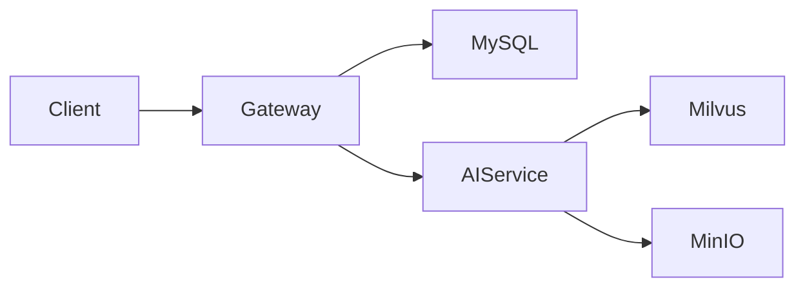

# 技术文档：[S5-7] 编写完整 README 与架构文档

> 版本：v1.0
> 日期：2026-07-16
> 作者：朱双泉
> 级别：后端/前端/AI 工程师
> 关联 PRD：[../prd/PRD_S5-7_readme_architecture_docs.md](../prd/PRD_S5-7_readme_architecture_docs.md)

---

## 1. 文档目标

定义 README、架构文档、部署文档和排障文档的内容结构、链接规范、校验方式与维护边界。

---

## 2. 技术栈

- Markdown / Mermaid
- markdownlint-cli
- markdown-link-check 或 lychee
- Docker / Kubernetes 命令示例

---

## 3. 接口契约

| 方法 | 路径 | 认证 | 说明 |
|---|---|---|---|
| 文档 | `README.md` | 无 | 项目入口 |
| 文档 | `docs/ARCHITECTURE.md` | 无 | 架构说明 |
| 文档 | `docs/DEPLOYMENT.md` | 无 | 部署说明 |

不涉及运行时请求/响应。

---

## 4. 配置

```json
{
  "markdownlint": {
    "MD013": false,
    "MD033": false
  }
}
```

链接检查可排除本地私有域名示例。

---

## 5. 模块设计

- README：项目定位、功能、技术栈、快速开始、测试、部署、截图。
- ARCHITECTURE：组件职责、数据流、异步任务、RAG 链路、可观测性。
- DEPLOYMENT：本地、Docker、K8s、域名、证书、Secret。
- TROUBLESHOOTING：常见错误码和排查步骤。

---

## 6. 关键代码实现

```markdown

```

---

## 7. 错误映射

| 场景 | HTTP 状态 | Error Code | Message |
|---|---|---|---|
| 链接失效 | N/A | DOC_LINK_BROKEN | 文档链接失效 |
| 命令不可执行 | N/A | DOC_COMMAND_INVALID | 文档命令不可执行 |
| 敏感信息泄露 | N/A | DOC_SECRET_DETECTED | 文档包含敏感信息 |

---

## 8. Web 端适配要点

README 中单独列出 Flutter Web 启动、构建、部署和已知限制。

---

## 9. 测试策略

- 静态测试：markdownlint、链接检查。
- 手工验证：快速开始命令和部署命令。
- 安全检查：敏感信息扫描。

---

## 10. 检查清单

- [ ] README 已更新
- [ ] 架构文档已更新
- [ ] Markdown lint 与链接检查通过
